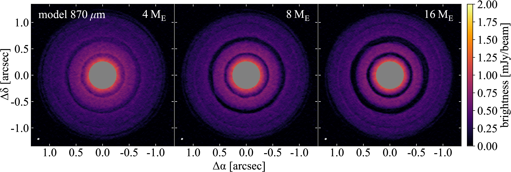

Super-Earths in the TW Hya disc
===============================

by Daniel Mentiplay, Daniel Price, and Christophe Pinte

Abstract
--------

> We test the hypothesis that the sub-millimetre thermal emission and scattered light gaps seen in recent observations of TW~Hya are caused by planet-disc interactions. We perform global three-dimensional dusty smoothed particle hydrodynamics simulations, comparing synthetic observations of our models with dust thermal emission, CO emission and scattered light observations.  We find that the dust gaps observed at 24~au and 41~au can be explained by two super-Earths ($\sim$~4~$\earth{}$). A planet of approximately Saturn-mass can explain the CO emission and the depth and width of the gap seen in scattered light at 94~au. Our model produces a prominent spiral arm while there are only hints of this in the data. To avoid runaway growth and migration of the planets we require a disc mass of $\lesssim 10^{-2}\,\sun{}$ in agreement with CO observations but 10--100 times lower than the estimate from HD line emission.

Results
-------

We aimed to reproduce recent observations of TW Hya.

*Synthetic observations of thermal dust continuum at 870 micron.*

*Synthetic observations of scattered light at 1.6 micron.*

Manuscript
----------

The manuscript is a separate git repository on GitHub. But it is included here as a git submodule.

Code
----

In the code directory there are:

* Phantom `.setup` and `.in` files used to generate the Phantom simulations
* MCFOST `.para` files for thermal dust continuum, scattered light, and CO line
  emission synthetic observations
* Splash config files to produce figures for the paper
* Plus various Python scripts to analysis and comparison with observations or
  analytic results

See `annotated_list_of_runs.txt` for a list of runs and the directories they are found in.

### Reproducibility

We used the Phantom version specified by the following git commit hash: f0a1825898dc778720d0cccacc4ea403c4c6de40

We used the MCFOST version specified by the following git commit hash: bc332ce
